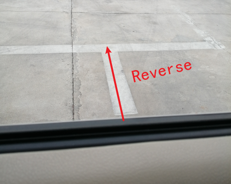

# 科二

！左转向

直行参照点：

## S弯

> （ 参照点）对其路中央
>
> （Toyota）~~触线~~ 上道牙子：左一圈 立
>
> （雨刷器根部）触线：回正
>
> （右滋水头）触线：右一圈立

车头盖线，左打满

进场——

​		与直角齐平：左打满
​		右缺口对准白线

             
一直这样
  

## 侧方停车

> 与树平齐：右打满
>
> 看到杆：回正
>
> 压线：左打满

>  ！左转向灯

> （雨刷根部）触线：回正
>
> （右缺口）过线：右一圈 立
>
> 回正，打左转向灯，用右缺口找线

## 直角弯

> ！左转向灯
>
> 车头盖线：看左边（与路边平行）：左打满

## 坡起

> 参考点对准 <u>停车线右面两点</u>
>
> 车头压线后，后视镜过3条白线：停车
>
> 拉手刹、松刹车
>
> 方向向左一点，踩油门、松手刹
>
> (下坡踩刹车，在道中央行驶)

## 倒车入库

### 进场

            

            

            

### 右后倒

            

            

            

            

### 出库

            

             
打成这样(左一圈立，过一些，到转速表0处)
  

            

### 左后倒

             
打成这样(左一圈立，过一些)
  

            

# 问题

上车下车动作